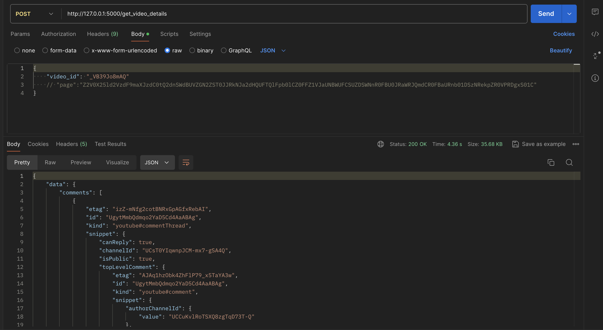

An assessment task from [Prodevs](https://www.prodevs.com)

# Contact Application Backend in Python-Django


A simple implementation of a fetching comments/details of youtube videos written in Python.

## Features

- Fetch Basic Video properties by supplying the video ID
- Read all top level comments
- Implemented Rate Limit on API calls
- Logging of critical code completion

## Installation

1. Clone the repository:

   ```bash
   git clone git@github.com:olartbaraq/Ytb_assess.git
   cd Ytb_assess
   ```

2. Prepare a standalone environment using anaconda or any python env. creation tool:

   ```bash
   conda create ytb_env python=3.12
   conda activate tyb_env
   pip install -r requirements.txt
   create a .env file inside project folder of [ytb_comments]
   ```

3. Add the following variables to the .env file:

   ```bash
      - `YT_API_KEY` : "Your Google API KEY"
      - `REDIS_URI` : "Your Redis URI"
      - `REDIS_HOST` : "Your Redis Host"
      - `REDIS_PORT` : "Your Redis Port"
      - `REDIS_PASSWORD`: "Your Redis Password"
      - `REDIS_USERNAME`: "Your Redis Username"
   ```

## Usage

1. Run the Flask server :

   ```bash
        flask --app ytb_comments run --debug --with-threads
        run http://127.0.0.1:5000/get_video_details in a API testing client e.g POSTMAN
        HTTP Method - POST
        body - {
          video_id - "Your Youtube Video ID"
          page - "nextPageToken"
        }
   ```

## Basic example


